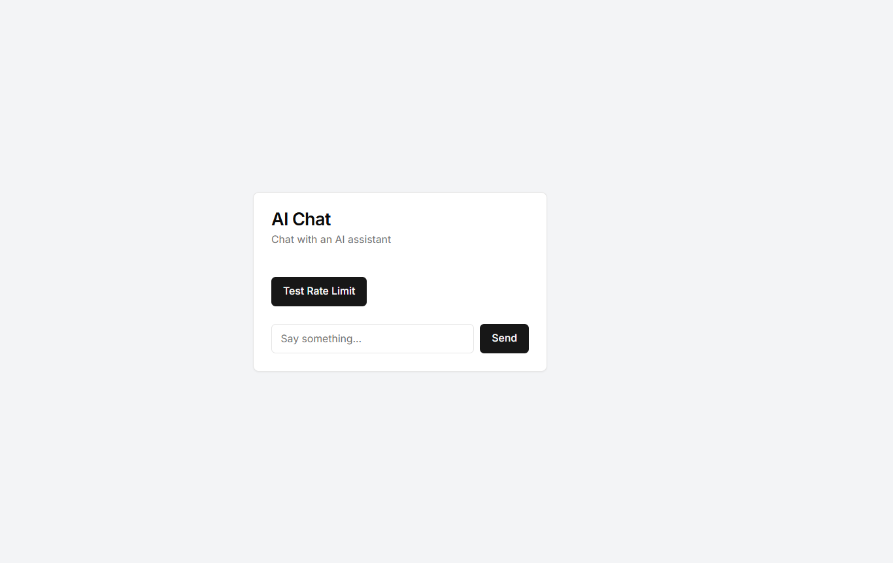

# AI Chat App with Rate Limiter

This is a mvp integration project in which I used Upstash Redis as Rate limiter for accessing the openai api calls.

Some of the features of the application

- A user-friendly chat interface built with **Next.js** and **React**
- Integration with **OpenAI GPT-3.5 model** for generating responses
- Rate limiting using **Upstash** to prevent abuse and manage costs
- A testing mechanism to verify the rate limiting functionality

## Getting Started

### Prerequisites

- OpenAI API key
- Upstash Redis database

Installing dependencies

```bash
npm i
```

Copy the env variables from `.env.example` and create a .env.local file and paste the variables.

Running the application
```bash
npm run dev
```

You can access the application at `localhost:3000`. The UI will look like this

